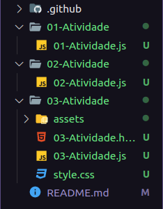
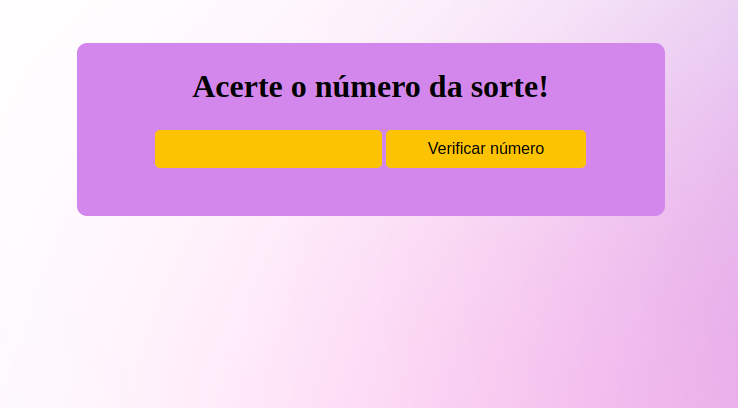

# Teste de algoritmo
Antes de prosseguir com a explicação de como testar o <b>código</b>, gostaria de informar que cada atividade foi colocado dentro de uma pasta distinta, porquê na <b>Atividade 03</b> fiz algo que precisou de uma organização de pasta melhor.

*Ficando com a estrutura:

*Para testar os códigos, solicito que faça o uso do Visual Studio Code e baixe as seguinte extensões:

1. Code Runner: https://marketplace.visualstudio.com/items?itemName=formulahendry.code-runner
  -Para fazer um script rodar basta teclar <b>ctrl + alt + n</b>.
  -Para poder parar o script basta teclar <b>ctrl + alt + m</b>.

  Obs: Solicito que use somente essa extensão para as <b>Atividades 1 e 2</b>.

2. Live Server: https://marketplace.visualstudio.com/items?itemName=ritwickdey.LiveServer

  -Para fazer rodar solicito que clique com botão direito no arquivo <b>index.html</b> e escolha a opção <b>"open with live server"</b>, provavelmente você verá uma tela assim:
  
  
  -Depois de abrir é só testar o funcionamento do programa.
  -Para ver o script, solicito que entre no arquivo <b>03.Atividade.js</b>, além do código, também tem algumas explicações do mesmo.

### Será avaliado:

* Clareza no código
* Estrutura de commits

### Atividade a ser realizada
Realizar o clone do repositório, crie uma nova branch com seu nome-sobrenome e implemente os seguintes algoritmos em arquivos/classes separadas, utilizando a linguagem/framework de sua escolha. Atualize o readme com uma breve descrição de como os algoritmos deveraão ser executados. Ao finalizar, crie um PR para avaliação.

1. Escreva um algoritmo que armazene o valor 10 em uma variável A e o valor 20 em uma variável B.
A seguir (utilizando apenas atribuições entre variáveis) troque os seus conteúdos fazendo com que o
valor que está em A passe para B e vice-versa. Ao final, escrever os valores que ficaram armazenados
nas variáveis e exibi-los na tela. 

2. Escreva um algoritmo que exiba na tela os valores impares no intervalo 0 a 100.

3. Escreva um algoritmo que capture a entrada de dados do usuário , e realize as seguintes validações enquanto o número for menor 7

  * Se o valor menor do 7, exibir que a entrada é menor do que o número de sorte.
  * Se o valor maior do que 7, exibir que a entrada é a maior do que o número de sorte.
  * Se o número for igual a 7, exibir "Você acertou" e finalizar o algoritmo.
  * Se o número for maior do que 10, exibir "O número de sorte deve ser de 0 a 10".
